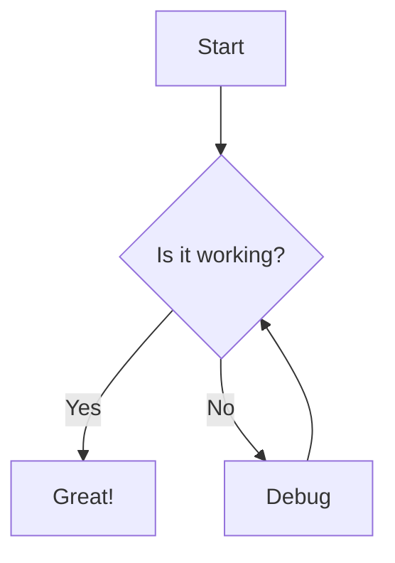

# MD Editor 使用说明

欢迎使用 **MD Editor**，这是一个功能强大的在线 Markdown 编辑器，灵感来源于 `md.a2data.cn`。

## 主要功能

### 1. 编辑与预览
- **实时预览**：左侧编辑，右侧实时渲染 HTML。
- **左右分栏**：拖拽中间的分隔条调整宽度。
- **快捷工具栏**：顶部工具栏提供加粗、斜体、列表、代码块等常用操作。
- **快捷键**：支持 `Ctrl+B` (加粗), `Ctrl+I` (斜体) 等。

### 2. 增强语法支持
- **代码高亮**：支持 JavaScript, Python, CSS 等多种语言高亮。
- **流程图 (Mermaid)**：使用 \`\`\`mermaid 语法绘制流程图。
- **数学公式 (LaTeX)**：使用 `$` 或 `$$` 编写数学公式。

### 3. 文件管理
- **自动保存**：内容会自动保存到浏览器本地存储，防止丢失。
- **导入/导出**：支持导入 `.md` 文件，或将当前文档导出为 `.md` 文件。
- **图片粘贴**：直接 Ctrl+V 粘贴图片，或拖拽图片到编辑器中（自动转换为 Base64）。

### 4. 个性化设置
- **主题切换**：右上角切换明亮/深色模式。
- **编辑器设置**：点击左下角设置图标，调整字体大小、行号显示和自动换行。

---

## 示例

### Mermaid 流程图

### 数学公式

行内公式：$E=mc^2$

块级公式：

$$
\frac{-b \pm \sqrt{b^2 - 4ac}}{2a}
$$

### 表格

| 功能 | 状态 |
| :--- | :--- |
| Markdown | ✅ |
| Mermaid | ✅ |
| LaTeX | ✅ |

开始您的创作吧！
